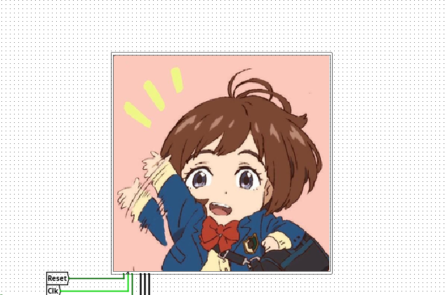

用ChatGPT写了个py小脚本，用于替换vga.hex的像素帧

使用方法：

```bash
$ python3 change_vga.py <image_file>
```

使用时需要确保所在目录下有vga.hex文件,且安装了ImageMagick工具集

话不多说直接上源码😋

```python
import subprocess
import sys
import os

# ---------------------------
# 1. 参数处理
# ---------------------------
if len(sys.argv) != 2:
    print(f"Usage: python {sys.argv[0]} <image_file>")
    sys.exit(1)

img_file = sys.argv[1]

if not os.path.exists(img_file):
    print(f"Error: file '{img_file}' not found")
    sys.exit(1)

# ---------------------------
# 2. 转换图片为 raw RGB
# ---------------------------
proc = subprocess.run(
    [
        'convert',
        img_file,
        '-resize', '256x256!',
        '-depth', '8',
        'rgb:-'
    ],
    stdout=subprocess.PIPE,
    stderr=subprocess.PIPE
)

if proc.returncode != 0:
    print("ImageMagick error:")
    print(proc.stderr.decode())
    sys.exit(1)

raw = proc.stdout

pixel_count = 256 * 256
assert len(raw) == pixel_count * 3, "RGB data size mismatch"

# ---------------------------
# 3. 生成 hex 行
# ---------------------------
words_per_line = 8
pixel_start_addr = 0x12bc0

new_lines = []

for i in range(0, pixel_count, words_per_line):
    addr = pixel_start_addr + i
    words = []

    for j in range(words_per_line):
        idx = (i + j) * 3
        r, g, b = raw[idx], raw[idx+1], raw[idx+2]
        words.append(f"00{r:02x}{g:02x}{b:02x}")

    new_lines.append(f"{addr:05x}: {' '.join(words)}")

# ---------------------------
# 4. 读取 vga.hex
# ---------------------------
with open('vga.hex', 'r') as f:
    lines = f.readlines()

# ---------------------------
# 5. 找 pixel 区域起点
# ---------------------------
start_idx = None
for i, line in enumerate(lines):
    s = line.strip()
    if s.startswith('12bc0:'):
        start_idx = i
        break

if start_idx is None:
    print("Error: start address 12bc0 not found in vga.hex")
    sys.exit(1)

# ---------------------------
# 6. 找结束位置
# ---------------------------
end_idx = None
for i in range(len(lines)-1, -1, -1):
    s = lines[i].strip()
    if s and ':' in s and not s.startswith('v'):
        end_idx = i
        break

if end_idx is None:
    print("Error: cannot determine end of vga.hex")
    sys.exit(1)

# ---------------------------
# 7. 替换区域
# ---------------------------
new_hex = (
    lines[:start_idx] +
    [line + "\n" for line in new_lines] +
    lines[end_idx+1:]
)

# ---------------------------
# 8. 写回文件
# ---------------------------
with open('vga.hex', 'w') as f:
    f.writelines(new_hex)

print(f"Updated vga.hex with image: {img_file}")
```

