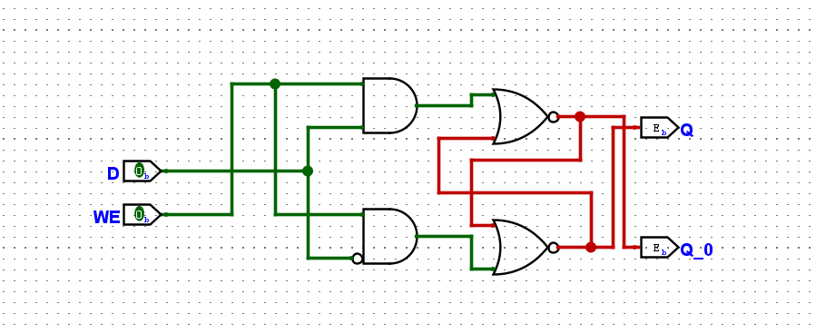
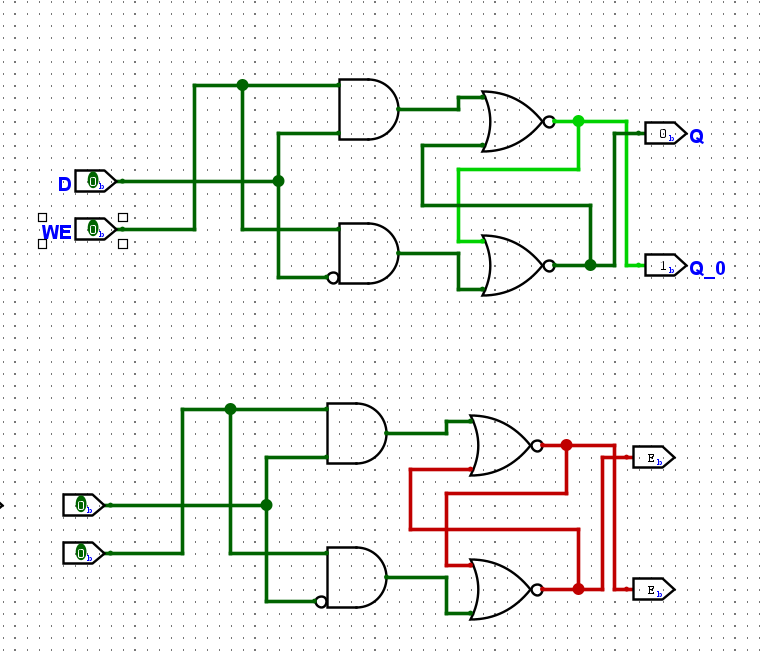
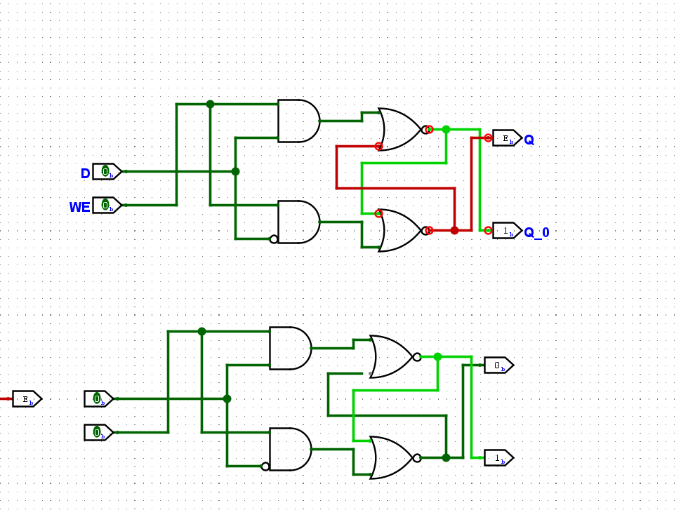
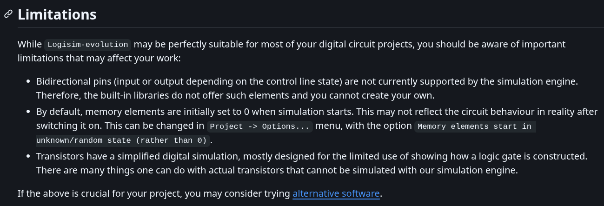

> 本文灵感来源于ysyx官方Q群用户“浪里个浪”对初学者使用Logisim时产生的对振荡问题的疑惑的解答。
> 我在该大佬的解答上进一步地总结和扩展，得出本文。
>
## 问题的提出

当我们在学习ysyx到F3阶段的时序逻辑电路部分时，往往容易在搭好了一个看似“正确”电路后，进行自动仿真，突然电路莫名奇妙地“爆红”
甚至出现"明显振荡（Oscillation Apparent)”的错误，
往往这些错误看起来会十分奇怪，因为这和我们学习到的理论不符。



而且“如果你有两个这样的锁存器，并且在初始化其中一个之后断开另一个，那么即使之前是稳定的，你初始化的那个设备也会开始振荡。”
（[issue#2454](https://github.com/logisim-evolution/logisim-evolution/issues/2454)）




> 当然，这里的“断开锁存器”的操作可以概括为“对dut外的电路进行的操作”

## 理论上的电路

这里先说一下为什么真实的电路不会像Logisim仿真表现出的情况一样
由于实际电路中，我们很难在物理上实现两个延迟，传播速度一模一样的门电路，再加上“正反馈机制”，对于锁存器,即使两个门完全对称，只要存在热噪声、器件失配、供电噪声等极小扰动，系统最终也会离开亚稳态并收敛到某个稳定状态。
> 正反馈机制：即假设一开始Q的电压为0.501，Q'的电压为0.499
>
> 在之后的信号传播中，电路会不断地放大这种差异

```text
// 以下为类比
 Q： 0.501 -> 0.51 -> 0.71 -> 0.95 -> 1
 Q': 0.499 -> 0.48 -> 0.28 -> 0.05 -> 0
```

事实上，$Vout^{+} = Vout^{-}$是最不稳定的一个状态

## 好吧，所以问题在哪里

既然我们已知真实电路的行为与Logisim的仿真行为不一致，那么就先从阅读Logisim的文档开始寻找答案吧！

### 问题1. Logisim检测振荡的手段简单


阅读Logisim的文档可知，Logisim检测振荡的手段仅仅是依靠维护一个计数器，当电路传播的次数达到一定数量后便会终止传播，
并报告振荡错误，这已经体现出Logisim在仿真的局限性——它不能无限地模拟信号传播直至达到稳态。

### 问题2. Logisim的内置存储元件初始值不随机

从[官方文档](https://github.com/logisim-evolution/logisim-evolution/blob/main/docs/docs.md#limitations)可知，为了简化实现，Logisim在初始化寄存器的值时的默认行为是简单地把存储元件的值设置为0。



这点通过阅读源代码也可发现

```java
public static final PrefMonitor<Boolean> Memory_Startup_Unknown =
      create(new PrefMonitorBoolean("MemStartUnknown", false));
// 默认为false，即初始化为0
```

但是现实中，所有数字电路中存储元件的初始值是不确定的，因此我们搭建的锁存器
的初始值应当是不确定的，直到接收到第一个复位或置位信号。

值得一提的是，Logisim-evolution提供了将寄存器初始值设置为不定值的选项，但毕竟这不是一个默认开启的选项，因此对于刚刚
学习到F3的我们来说，很容易会对讲义中的电路行为与内置元件行为的不一致感到困惑。

事实上，仿真前及时地对电路进行复位，使得寄存器得到一个确定的值，芯片电路进入一个已知的状态是**十分重要**的，
就像软件工程的Undefined Behavior，作为仿真人员，我们应当遵循一定的规范。
如果因为未复位造成的仿真行为与真实电路行为不一致，责任应由**仿真人员**承担。

### 问题3. 在组合逻辑中W(Wrong)信号的传播是几乎不能阻止的

这是造成图一中，当WE=0时，Q和Q'的输出为W的主要原因。
通过手动在Logisim中进行实验，可发现W信号在组合逻辑的电路的传播是难以被屏蔽的，
而Logisim在初始化组合逻辑信号时会把他们全部设置为U(Undefined)，
而U在经过组合逻辑后会变为W,最终导致了我们看到的电路“莫名奇妙“的爆红。

另外补充下造成图二，图三现象的原因，其实在上文中提到的[issue](https://github.com/logisim-evolution/logisim-evolution/issues/2454)下面的评论区就有人解释了这个现象，我这里对其概括一遍：在Logisim中，当我们更改了电路的连线时，Logisim会重新计算所有的信号，因为任何旧的
导线中的信号都有可能因为连线的改变而改变。
因此当图三中“断开锁存器”的行为发生时，Logisim会把重新计算一遍所有信号，又因为上面关于U和W信号的阐述，因此原本稳定的锁存器会进入到一个振荡的状态。
> 补充下为什么会产生错误的一点细节，当我们把锁存器的WE设置为0时，Q(Q')的输出只由Q'(Q)决定，但是Q'(Q)的初始信号又被设置为了U,因此原本稳定的锁存器会在新一轮信号计算中进入到一个振荡的状态。

## 为什么使用内部寄存器时基本不会产生振荡问题

除了初始值不随机外，其他原因可通过阅读Logisim-evolution的源码得知

```java
private static class StateData extends ClockState
// logisim的内部存储元件拥有单独的一个类对其管理
```

```java
@Override
  public void propagate(InstanceState state) {
    // boolean changed = false;
    StateData data = (StateData) state.getData();
    if (data == null) {
      // changed = true;
      data = new StateData();
      state.setData(data);
    }

    int n = numInputs;
    Object triggerType = state.getAttributeValue(triggerAttribute);
    boolean triggered = data.updateClock(state.getPortValue(n), triggerType);
    if (state.getPortValue(n + 3) == Value.TRUE) { // clear requested
      // changed |= data.curValue != Value.FALSE;
      data.curValue = Value.FALSE;
    } else if (state.getPortValue(n + 4) == Value.TRUE) { // preset
      // requested
      // changed |= data.curValue != Value.TRUE;
      data.curValue = Value.TRUE;
    } else if (triggered /* && state.getPortValue(n + 5) != Value.FALSE */) {
      // Clock has triggered and flip-flop is enabled: Update the state
      final var inputs = new Value[n];
      for (var i = 0; i < n; i++) {
        inputs[i] = state.getPortValue(i);
      }


      final var newVal = computeValue(inputs, data.curValue);
      if (newVal == Value.TRUE || newVal == Value.FALSE) {
        // changed |= data.curValue != newVal;
        data.curValue = newVal;
      }
    }


    state.setPort(n + 1, data.curValue, MemoryLibrary.DELAY);
    state.setPort(n + 2, data.curValue.not(), MemoryLibrary.DELAY);
  }

```

关键是37-38行，从中我们可以发现存储元件内部状态的更新时机和我们自己用门电路搭出来的寄存器的信号更新时机是不一致的，
这点有些像是对verilog仿真手册提到的事件队列的实现。

```text
// verilog手册中演示事件队列的伪代码
while (there are events) {
  if (no active events) {
    if (there are inactive events) {
      activate all inactive events;
    } else if (there are nonblocking assign update events) {
      activate all nonblocking assign update events;
    } else if (there are monitor events) {
      activate all monitor events;
    } else {
      advance T to the next event time;
      activate all inactive events for time T;
    }
  }
  E = any active event;
  if (E is an update event) {
    update the modified object;
    add evaluation events for sensitive processes to event queue;
  } else { /* shall be an evaluation event */
    evaluate the process;
    add update events to the event queue;
  }
}

```

## 总结

总的来说，Logisim并没有模拟真实的物理电路，而是通过维护一个离散的事件队列，里面的信号一般只有0/1两态，
无法模拟双稳态电路在正反馈机制作用下收敛到稳态的过程，大致的仿真过程可抽象为：

```text
->输入发生变化
->重新计算输出
->信号发生变化
->重新计算信号，直至没有信号发生变化或达到最大信号传播次数
```

我们在使用logisim时，应更多聚焦于学习硬件思维，同时也理解到Logisim的局限性，避免在仿真中出现不必要的困惑。
> 从某种意义上说，Logisim 的行为并非“错误”，而是在其离散事件驱动模型下的合理结果。问题的根源并不是 Logisim 无法模拟锁存器，而是锁存器本身依赖于模拟电路层面的收敛过程，而这超出了 Logisim 的建模范围。
