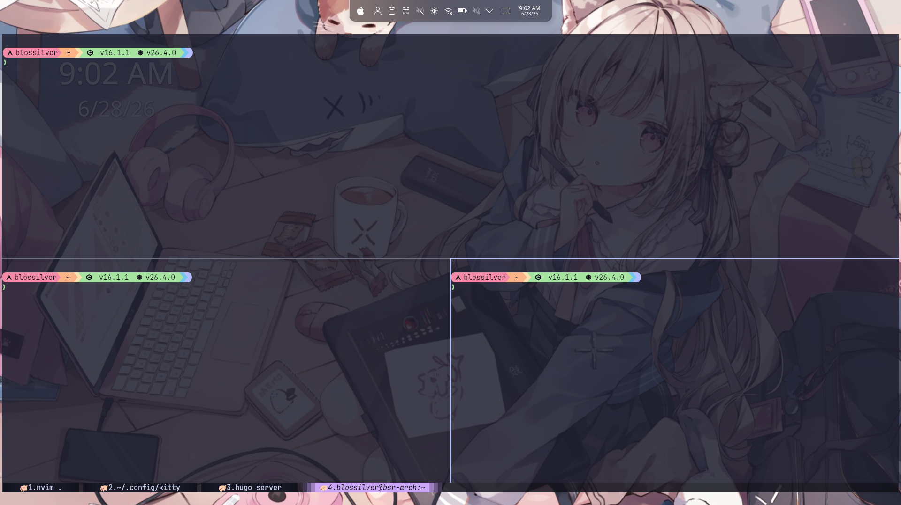

使用linux的过程中，终端模拟器是我们常会接触到的软件，因此在提升使用体验乃至美观程度这一问题上，许多人都给出了不同组合方案，我也来凑个热闹，分享下我本人
目前正在使用的终端方案（也是社区内常见的主流工具），maybe能让你有眼前一亮的感觉！

## 终端模拟器 Kitty

Kitty是由[Kovid Goyal]()开发的一个具有许多现代化功能的终端模拟器，据说由于Kovid不能忍受Tmux对资源的大量占用，因此kitty诞生了。Kitty相比许多桌面系统自带的terminal，
拥有如图片协议，分屏，多窗口等实用功能，以及最近合并的非常非常cool的光标跳转动画（It really turns me on），并且对纯键盘操作的支持非常不错，提供了许多操作的快捷键，
同时快捷键的绑定也和tmux一样，支持自定义。另外，kitty也支持透明背景，去除窗口装饰，导入主题等常见功能。



### 配置

这里分享下我本人的kitty配置

```conf
# fonts
font_family JetBrainsMono Nerd Font
font_size 11.5


# layout
enabled_layouts splits, stack
hide_window_decorations true

# map ctrl+[ layout_action decrease_num_full_size_windows
# map ctrl+] layout_action increase_num_full_size_windows
# map ctrl+/ layout_action mirror toggle
# map ctrl+y layout_action mirror true
# map ctrl+n layout_action mirror false

#: keymaps
#: tab
map ctrl+shift+i  set_tab_title
# map ctrl+shift+] next_tab
# map ctrl+shift+[ previous_tab
# map ctrl+shift+. move_tab_forward
# map ctrl+shift+, move_tab_backwa# rd
map alt+1        goto_tab     1 
map alt+2        goto_tab     2
map alt+3        goto_tab     3 
map alt+4        goto_tab     4 
map alt+5        goto_tab     5 
map alt+6        goto_tab     6 
map alt+7        goto_tab     7 
map alt+8        goto_tab     8 
map alt+9        goto_tab     9 
map alt+0        goto_tab     10 

# goto the previous tab you are working on
map alt+p        goto_tab     -1
map ctrl+alt+z toggle_layout stack

# the cursor animations
cursor_trail 3


# BEGIN_KITTY_THEME
# Catppuccin-Mocha
include current-theme.conf
# END_KITTY_THEME

background_opacity 0.86
dynamic_background_opacity yes
# Create a new window splitting the space used by the existing one so that
# the two windows are placed one above the other
map ctrl+shift+' launch --location=hsplit

# Create a new window splitting the space used by the existing one so that
# the two windows are placed side by side
map ctrl+shift+5 launch --location=vsplit
#: broadcast
map f1 launch --allow-remote-control kitty +kitten broadcast --match-tab state:focused
#: resizing window
map cmd+r start_resizing_window
map ctrl+shift+i resize_window wider
map ctrl+shift+m resize_window narrower
map ctrl+shift+k resize_window taller
map ctrl+shift+j resize_window shorter
map ctrl+shift+r resize_window reset

#: tab
tab_bar_edge       bottom
tab_bar_style      fade 
tab_bar_min_tabs   1
# tab_separator      " ┃ "
tab_title_template "🐖{index}.{title}"

#: ssh
share_connections yes
```

> [!Tips] 由于我用的是预装windows的电脑，因此mac用户需要根据自己的实际键位调整上述快捷键
>
> 导入主题可通过指令**kitten themes**进入主题选择的交互式界面，完成选择后kitty会自动在$HOME/.config/kitty/下生成对应的主题文件并在kitty.conf中增加对应的导入指令，无需手动include

其中每个配置的具体功能可在[kitty官方文档](https://sw.kovidgoyal.net/kitty/)中查阅

### 能否取代tmux？

我相信许多ysyxers已经使用过了tmux这一强大的终端复用器，那么我们的kitty和tmux相比又有什么优势呢？

kitty和tmux的功能都很强大，因此不是所有功能我都尝试过，因此这里主要讲我在使用过程中感受到的二者较明显的差异。

1. kitty默认支持通过鼠标上下滑动窗口的功能，而tmux需要额外配置。
2. 在tmux的标准输出只能看到有限行数，这意味着如果你的程序输出过多，会丢失内容，而kitty不仅没有这一限制，更有支持通过less查看上一次命令执行的标准输出的功能。
3. kitty在切换窗口/tab的操作体验更丝滑，如你只需按住ctrl+shift+方向键即可快速左右切换tab，而tmux需要先按一次prefix，再按下p或者n才能**切换一次**，在连续左右切换tab上非常不方便。
4. tmux对于标准输出的保护功能欠缺，有时会因为意外在标准输出打印了某些二进制文件，破坏了终端的正常功能，只有重新打开一个新的终端才能解决。

总而言之，在日常使用上，得益于kitty的高现代化程度，kitty的使用体验我认为是明显优于tmux的，不过也有一些局限：

- kitty不具备tmux的会话挂起功能。会话挂起配合ssh，很好解决了远程执行长时间运行的程序时的不便。同时tmux在远程二人协作coding上也表现得十分不错。
- kitty分割出的新窗口默认位于$HOME目录下，而tmux在分割窗口时可以保存当前处于的路径，这在我们分割窗口，对同一程序进行调试时较为方便。
